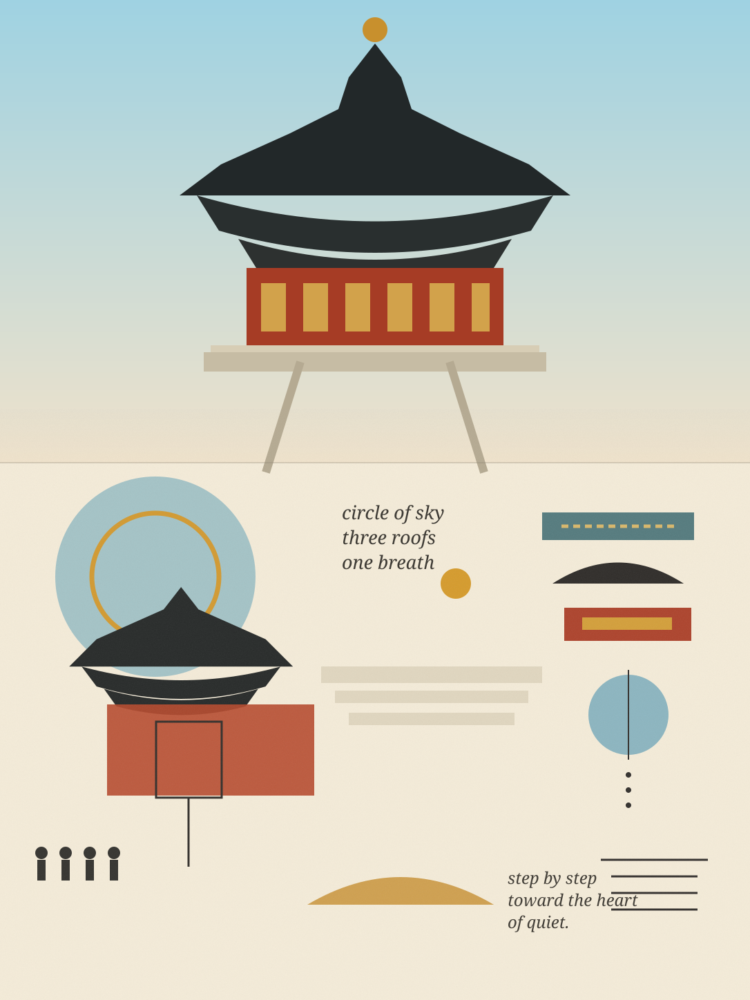

<p align="center">
  
</p>

<h1 align="center">Tree · Poetic Editorial Collage Skill</h1>

<p align="center">
  Turn a reference photo into an adaptive visual diary: real photography above, poetic editorial collage below.
</p>

<p align="center">
  <strong>Interpret first. Translate second. Never apply a fixed template.</strong>
</p>

---

## What this skill does

`photo-poetic-editorial-collage` analyzes a reference photograph before composing anything. It extracts subject, mood, geometry, movement, cultural context, color relationships, and latent meaning, then translates those signals into a small visual vocabulary of:

- cut-paper-like shapes and softly imperfect silhouettes;
- abstract symbols and visual metaphors;
- handwritten or lightly typeset poetic fragments;
- grain, paper texture, stamped surfaces, pencil / ink traces;
- asymmetric editorial relationships and generous negative space;
- visual echoes that connect the photographic region to the collage region.

The lower half is **not** a literal redraw of the photograph. Every source image should generate a different composition.

## Example

<p align="center">
  
</p>

This example interprets the Temple of Heaven through stacked roof silhouettes, circles, steps, printed texture, architectural rhythm, and sparse poetic notes rather than reproducing the scene literally.

---

## One-command install for Codex

### GitHub CLI

Install globally for Codex:

```bash
gh skill install Tree-oil/Tree-Poetic-Collage-Skill photo-poetic-editorial-collage --agent codex --scope user
```

Install only for the current project:

```bash
gh skill install Tree-oil/Tree-Poetic-Collage-Skill photo-poetic-editorial-collage --agent codex --scope project
```

`gh skill install` discovers skills from the standard `skills/*/SKILL.md` layout and supports Codex as a target agent.

### Install from inside Codex

You can also ask Codex's skill installer to install the GitHub directory directly:

```text
$skill-installer install https://github.com/Tree-oil/Tree-Poetic-Collage-Skill/tree/main/skills/photo-poetic-editorial-collage
```

If the skill does not appear immediately after installation, start a new Codex session or restart Codex.

---

## Usage

Attach a reference photograph and use a short instruction such as:

```text
Use $photo-poetic-editorial-collage on this image.
```

Or provide controls only when you want to override the skill's own art direction:

```text
Use $photo-poetic-editorial-collage.
Keep a 55/45 photo-to-collage split, use Chinese handwritten fragments,
and make the lower section sparse and more abstract.
```

Example Chinese prompts:

```text
用 $photo-poetic-editorial-collage 处理这张照片。
不要套固定模板，根据照片内容自己决定符号、诗句和构图。
```

```text
用这个 Skill。上半部分保留真实照片，下半部分更抽象，
少量中文手写文字，纸张和印刷质感更明显。
```

## Adaptive controls

The skill can infer everything automatically, but supports explicit overrides:

| Control | Examples |
| --- | --- |
| `photo_ratio` | `60/40`, `50/50`, `40/60` |
| `text_language` | Chinese, English, bilingual, none |
| `editorial_density` | sparse, medium, dense |
| `material_bias` | paper, ink, stamp, pencil, fabric, mixed |
| `poetry_level` | literal, restrained, poetic, abstract |
| `preserve_ui` | true / false |
| `aspect_ratio` | source, 4:5, 3:4, 1:1, 9:16 |

## Core composition logic

Each image is compiled through seven conceptual moves:

1. **Anchor** — one dominant motif derived from the source.
2. **Echo** — one or two geometric relationships repeated abstractly.
3. **Counterpoint** — an unexpected symbol that reveals hidden meaning.
4. **Trace** — a hand-drawn path, ring, line, measure, or diagram.
5. **Voice** — a few image-specific words or poetic notes.
6. **Air** — intentional negative space.
7. **Bridge** — at least one relationship between the photograph and collage.

## Behavior with social-media screenshots

When a source contains TikTok / Xiaohongshu / Instagram-style UI, counters, stickers, buttons, or unrelated overlays, the skill defaults to removing those interface elements and reconstructing the photographic region plausibly before building the collage language.

## Codex note

This repository uses the Agent Skills folder convention so Codex can discover and install it. The skill itself is an art-direction and image-workflow skill: when the host has image-generation / image-editing capability, it should render the result; when it does not, it should return a production-ready image prompt and art-direction package instead of pretending an image was generated.

## Repository structure

```text
Tree-Poetic-Collage-Skill/
├── README.md
├── assets/
│   └── readme-hero.webp
└── skills/
    └── photo-poetic-editorial-collage/
        ├── SKILL.md
        ├── agents/
        │   └── openai.yaml
        └── assets/
            ├── icon.svg
            └── example-output.svg
```

## Design principles

- Interpret before composing.
- Translate instead of tracing.
- Never reuse a rigid poster template.
- Keep typography sparse and image-specific.
- Prefer semantic symbols over decorative stickers.
- Preserve negative space.
- Let naïve forms carry precise conceptual meaning.
- Keep the final work tactile, editorial, poetic, and restrained.

---

<p align="center">
  <strong>Tree Personal IP · Skill 001</strong><br/>
  <sub>Built around adaptive visual interpretation, not preset layouts.</sub>
</p>
